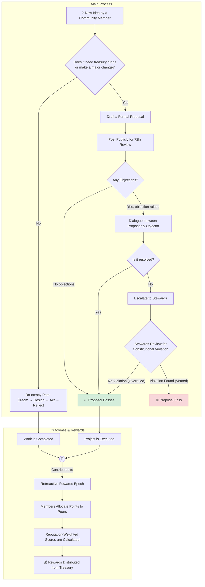

```mermaid
graph TD
    subgraph "Main Process"
        A[💡 New Idea by a Community Member] --> B{Does it need treasury funds <br> or make a major change?};

        B -- No --> C[Do-ocracy Path: <br> Dream → Design → Act → Reflect];
        B -- Yes --> D[Draft a Formal Proposal];

        D --> E[Post Publicly for 72hr Review];
        E --> F{Any Objections?};

        F -- No objections --> G[✅ Proposal Passes];
        F -- Yes, objection raised --> H[Dialogue between Proposer & Objector];

        H --> I{Is it resolved?};
        I -- Yes --> G;
        I -- No --> J[Escalate to Stewards];

        J --> K{Stewards Review for <br> Constitutional Violation};
        K -- No Violation (Overruled) --> G;
        K -- Violation Found (Vetoed) --> L[❌ Proposal Fails];
    end

    subgraph "Outcomes & Rewards"
        G --> M[Project is Executed];
        C --> N[Work is Completed];
        M --> O((🔄));
        N --> O((🔄));
        O -- Contributes to --> P[Retroactive Rewards Epoch];
        P --> Q[Members Allocate Points to Peers];
        Q --> R[Reputation-Weighted Scores are Calculated];
        R --> S[💰 Rewards Distributed from Treasury];
    end

    style G fill:#d4edda,stroke:#c3e6cb
    style L fill:#f8d7da,stroke:#f5c6cb
```